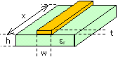

# Microstrip Impedance Calculator

Microstrip is a topology that is used to provide a trace-controlled impedance on a PCB for digital circuits. 

Microstrip lines are exposed to both air and a dielectric referenced to a planar structure. Purpose of this notebook is to be used to calulate an impedance and a differential impedance of the microstrip topology. 

Sample calculations are provided for 90 and 100 Ohm differential impedance in standard 4-layer PCB stackup.

